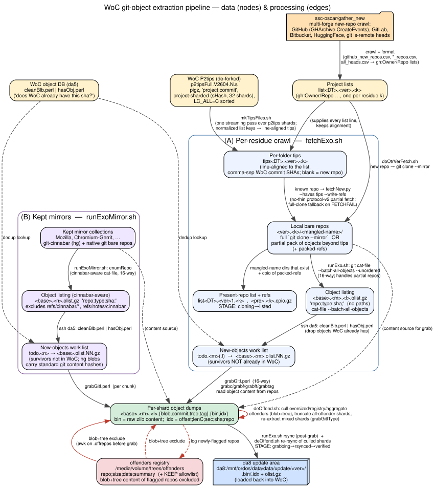

# WoC git-object extraction pipeline

End-to-end data flow for the Jetstream2 extraction run: from upstream WoC
inputs and remote repositories to the per-shard object dumps loaded back into
WoC. **Nodes are data artifacts; edges are processing steps** (the script/tool
that consumes the source and produces the target).

See [`pipeline.dot`](pipeline.dot) for the graph source.

```
dot -Tpng pipeline.dot -o pipeline.png      # or -Tsvg
```



Two ingest fronts feed the same sink (the da8 update area, which is loaded back
into WoC):

- **(A) per-residue crawl** — `fetchExo.sh` = `doOtrVerFetch.sh` + `runExo.sh`
- **(B) kept large mirrors** — `runExoMirror.sh` (Mozilla, Chromium-Gerrit; hg+git)

## Upstream inputs (read-only)

| Data | What |
|------|------|
| **WoC P2tips** (de-forked) | `p2tipsFull.V2604.N.s` — pigz, `project;commit`, project-sharded by `sHash` (32 shards), `LC_ALL=C` sorted. The commit tips WoC already has per project. |
| **Project lists** | `list<DT>.<ver>.<k>` — one per residue `k`, entries like `gh:Owner/Repo`. Produced upstream by [`ssc-oscar/gather_new`](https://github.com/ssc-oscar/gather_new) (see below). |
| **WoC object DB (da5)** | queried via `cleanBlb.perl \| hasObj.perl` — "does WoC already have this sha?" |

### Where the project lists come from — `ssc-oscar/gather_new`

The `list<DT>.<ver>.<k>` inputs are not produced here; they originate from the
separate [`ssc-oscar/gather_new`](https://github.com/ssc-oscar/gather_new) repo,
which crawls new/updated repositories across forges (`update.sh`):

- **GitHub** — GHArchive hourly `CreateEvents` (`gharchive_download.pl`,
  `gharchive_extract.pl`) → `data/github_new_repos.csv`
- **GitLab** — gitlab.com API plus other instances (gnome, debian/salsa,
  drupalcode) (`crawl_gitlab_repos.py`, `gitlab_to_csv.pl`) → `data/*_repos.csv`
- **Bitbucket** — `list_bitbucket_workspaces.py`, `crawl_bitbucket_repos.py`
- **HuggingFace** — Parquet snapshots + API for models/datasets/spaces
  (`hf_refresh.py`) → `data/hf_*.ndjson.gz`
- **Git heads** — `git ls-remote` across hosts (`heads_prepare.sh`,
  `heads_run.sh`) → `data/all_heads.csv` (`gh:repo;sha;ref`)

These crawl outputs are turned into the per-residue `gh:Owner/Repo` lists that
this pipeline consumes.

## offenders registry (read + write)

`/media/volume/trees/offenders` (`repo;size;date;summary`, plus a `KEEP`
allowlist). Blob **and** tree content of flagged repos is excluded from dumps —
both at grab time (`runExo`/`runExoMirror` `.offrepos` filter) and after the
fact (`deOffend.sh`). `deOffend.sh` also appends newly-detected offenders.

## (A) Per-residue crawl — `fetchExo.sh`

1. **Tips alignment** — `mkTipsFilesJoin.sh` joins P2tips against the list:
   normalize each list entry to a p2tips key → `splitSecCh` into shards → per-shard
   sort-merge `join` → re-split and re-order back to list order. Produces
   **`tips<DT>.<ver>.<k>`**, line-aligned to the list (comma-separated WoC commit
   SHAs; blank line = repo new to WoC).
2. **Clone / partial fetch** — `doOtrVerFetch.sh`:
   - repo WoC already knows (has tips) → `fetchNew.py --haves <tips> --write-refs`
     (no-thin protocol-v2 partial fetch: only objects beyond the tips; full
     `git clone --mirror` fallback on `FETCHFAIL`),
   - new repo → `git clone --mirror`.
   Produces **local bare repos** under `<ver>.<k>/<mangled-name>/` plus the
   present-repo list `list<DT>.<ver>1.<k>` and a `packed-refs` cpio.
   STAGE: `cloning → listed`.
3. **Enumerate** — `runExo.sh`: `git cat-file --batch-all-objects --unordered
   --batch-check='%(objectname) %(objecttype)'` (16-way; ~6× faster than
   `rev-list --objects --all` and works on partial-fetch repos). Produces the
   **olist** `<base>.<m>.<l>.olist.gz` — lines `repo;type;sha;` (no paths; WoC
   rebuilds filenames from the dumped tree objects).
4. **WoC dedup** — `ssh da5 'cleanBlb.perl | hasObj.perl'` drops objects WoC
   already has, leaving the **new-objects work list** `todo.<m>` →
   `<base>.<m>.olist.NN.gz`.
5. **Grab / dump** — `grabGitI.perl` (16-way) drives the C tools
   `grabc/grabf/grabft/grabtag` to read raw object content from the repos. The
   offenders blob+tree exclusion is applied first. Produces **per-shard dumps**
   `<base>.<m>.<l>.{blob,commit,tree,tag}.{bin,idx}` — `.bin` = raw zlib content,
   `.idx` = `offset;lenC;sec;sha;repo`.

## (B) Kept mirrors — `runExoMirror.sh`

Mirror collections that are kept locally (Mozilla, Chromium-Gerrit) contain
git-cinnabar (hg) plus native git bare repos. `enumRepo` is **cinnabar-aware**:
for cinnabar repos it enumerates only objects reachable from the real converted
refs, excluding `refs/cinnabar/*` and `refs/notes/cinnabar` (hg bookkeeping, not
source). The converted objects carry standard git content/tree hashes, so they
dedup against WoC's git objects across VCS — a file's git blob SHA is the same
whether it came from git or hg. From there the flow matches Front A: enumerate →
`cleanBlb|hasObj` dedup → `grabGitI` dump → the same per-shard dumps.

## De-offend — `deOffend.sh`

Runs periodically during the grab and as a final sweep. On the dumps it culls
(a) per-shard size offenders, (b) cross-shard aggregate offenders, and (c)
registry offenders — removing blob **and** tree content. Mixed shards are
re-extracted with `grabGitIType.perl`; shards that are 100% offender are
truncated. It logs new offenders to the registry, and — once a dataset is
already rsynced — re-rsyncs just the shards it culled to da8 before upgrading
STAGE to `verified` (so a post-rsync cull never leaves stale data on da8).

## Sink — da8 update area

`rsync` (post-grab in `runExo`/`runExoMirror`, plus `deOffend`'s re-rsync of
culled shards) writes the `.bin/.idx` dumps and `olist.gz` to
`da8:/mnt/ordos/data/data/update/<ver>/`, which is loaded back into WoC. Repo
STAGE lifecycle: `cloning → listed → grabbing → rsynced → verified` (verified =
safe to delete the local clones and dumps).

## Optional: two-phase deferred-blob extraction (opt-in)

A separate, **opt-in** path fetches commits+trees now and defers blob content,
for an up-to-date view of activity (messages, authors, filenames) without paying
for content up front. Most valuable for huge **updated** repos: with WoC tips as
haves, `filter blob:none` fetches only the *new* commits/trees beyond WoC and no
blobs. The normal full path (`fetchExo.sh`) is unchanged; these tools are only
used when invoked explicitly.

- **`fetchExoP1.sh <m> <ver> <DT> [out] [filter]`** — phase 1. Runs
  `doOtrVerFetch.sh` with `FILTER` set (default `blob:none`), then **persists the
  per-repo blob backfill want-list** (`backfill.<m>.gz`, deduped vs WoC) and a
  `urls.<m>.gz` map *before* repos are deleted, dumps/rsyncs the commits/trees,
  and marks `PHASE=blobs-pending`. (Repos can then be removed — there isn't disk
  to keep them, which is why the want-list must be computed in phase 1.)
- **`backfillExo.sh <m> <ver> <DT> [out]`** — phase 2. Works purely from
  `backfill.<m>.gz` + `urls.<m>.gz` (repos gone): re-dedups vs current WoC,
  optionally restricts to `SELECT=<repo-list>` (metadata-driven deep-extraction
  selection), fetches each repo's blob OIDs (`fetchNew.py --want-file`, **no
  haves** so the server can't drop reachable blobs), dumps them into `.bf.`
  shards, rsyncs, and marks `PHASE=blobs-done`.

Building blocks (also opt-in / additive, default behavior unchanged):
`fetchNew.py --filter <spec>` (honored only if the server advertises the `fetch`
`filter` sub-capability; else degrades to full and reports `filter_applied=0`),
`fetchNew.py --want-file <oids>` (phase-2 explicit-OID fetch), and
`backfillList.sh <repo>` (lists blob OIDs referenced by trees but absent after a
`blob:none` fetch). `doOtrVerFetch.sh` honors `$FILTER` (empty = unchanged).
Because objects are content-addressed and `hasObj` dedups, the two phases
converge automatically — the eventual full WoC just backfills.
