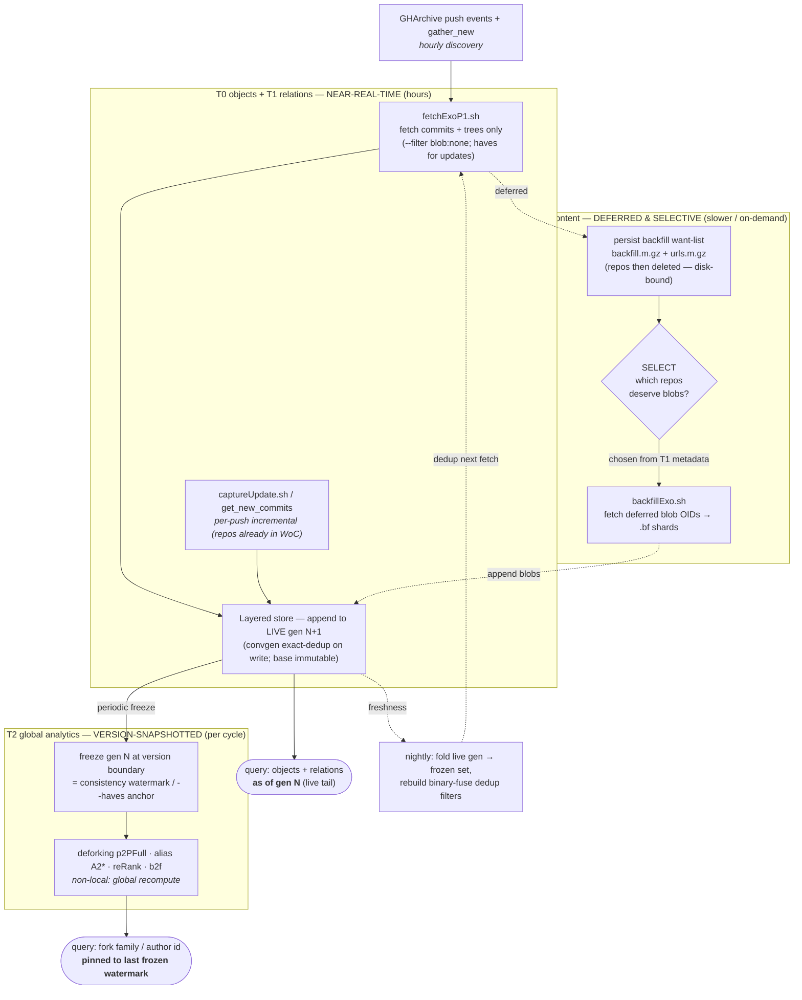

# Real-time WoC — architecture & feasibility evaluation

**Question.** Today WoC advances in discrete *version watermarks* (…V2604 → V2605…),
each a months-long batch: crawl → clone → dedup → grab → drain → convert → rebuild all
maps → publish. Can it instead advance *continuously* — new commits queryable minutes-to-
hours after they are pushed, with no full-collection rebuild? This document evaluates
what is already real-time-capable, what blocks it, and a phased path.

It is a companion to [`PIPELINE.md`](PIPELINE.md) (the batch data flow) and
[`LAYERED_STORE.md`](LAYERED_STORE.md) (the append-only store that makes most of this
possible). Read those first.

---

## Architecture at a glance

The shape of the proposal: split the pipeline by **freshness tier**. The cheap, high-value
tiers (commits, trees, relations) stream through the append-only store within hours; the heavy
tier (blobs) is deferred and selective; global analytics are pinned to the last frozen
generation. Solid arrows = live/streaming path; dashed = deferred or periodic.

---

## 1. What "real-time" means here (define the target before judging feasibility)

"Real-time" is not one latency; the pipeline has three distinct freshness clocks and they
decouple. Be explicit about which one a consumer needs:

| Tier | Artifact | Consumer question | Current latency | Floor (best achievable) |
|------|----------|-------------------|-----------------|--------------------------|
| **T0 Object present** | raw obj in store (blob/tree/commit) | "is this sha retrievable?" | version cycle (weeks–months) | **minutes–hours** |
| **T1 Relation** | `c2dAt`, `c2p`, `P2c`, tips | "what are this project's commits / this commit's parents?" | version cycle | **hours** (incremental) / cycle (today) |
| **T2 Derived analytics** | `A2*` alias/identity, deforking `p2PFull`, `b2f`, reRank | "who authored this / what is the canonical fork?" | version cycle | **cycle-bound** (global recompute) |

The honest headline: **T0 is nearly real-time-ready today; T1 is feasible with incremental
maintenance; T2 is intrinsically batch** (it needs global structure — identity resolution,
fork-family connected components, ranking — that changes non-locally when any node is added).
A useful "real-time WoC" is therefore **T0/T1 streaming over a periodically-frozen T2**, not
uniform real-time everywhere. Promising more than that would be dishonest about the analytics.

---

## 2. Stage-by-stage: current cadence vs. real-time ceiling

| Stage | Tool / host | Cadence today | Real-time ceiling | Blocker to closing the gap |
|-------|-------------|---------------|-------------------|----------------------------|
| Discovery | `gather_new` (GHArchive hourly `CreateEvents`, GitLab/BB APIs) — clone0/gather | hourly feed, batched into `list<DT>.NNN` | **hourly** (GHArchive granularity) | none structural — feed is already hourly; just chunked coarsely |
| Missing-HEAD test | `heads_missing.sh` + da5 `hasObj commit` | per-batch | **seconds/repo** | needs live object-DB (see dedup) |
| Clone / fetch | `doOtrVerFetch.sh` (libgit2-woc) — clone0 | per-residue batch | **per-repo** | embarrassingly parallel; disk/landing-zone throughput only |
| Enumerate | `classify` / `cat-file --batch-all-objects` | per-shard | **per-repo** | none |
| **Dedup** | `hasObjBF` (binary-fuse, da5 `/fast`) + `hasObj.perl` | filters frozen per version | **hours** | **BF is static** — built from the frozen set, can't be appended (§4) |
| Grab | `grabGitI` → `{type}.{bin,idx}` — clone0 | per-shard | **per-repo** | none |
| Offender guard | `offsweep*` (per-shard largest.sh, >5h watchdog) | **already near-real-time** | seconds after shard | none — this stage is already the model |
| Drain | rsync → da8 `update/<VER>` | per-shard, flock-serialized | **per-shard** | none |
| **Store ingest** | `convgen`/`sidx` → layered gen (append, dedup-on-write) | continuous append during a version | **near-instant** | **none — layered store already does this** (§3) |
| **T1 maps** | `c2dAt`, `P2c`, tips … — isaac SLURM, 128-shard | full rebuild per version | **hours (incremental)** | maps rebuilt wholesale, not appended (§5) |
| **T2 analytics** | `A2*`, `p2PFull` deforking, reRank, `b2f` — isaac SLURM | full recompute per version | **cycle-bound** | global/non-local computation (§6) |

---

## 3. The enabler — the layered store already makes ingest real-time

`LAYERED_STORE.md` is the load-bearing piece. Its design **already removes the single
biggest batch barrier** (mutating a 3 PB store):

- **Immutable base + append-only L1/gens.** New objects append into `L1/{type}_{sec}.bin`;
  existing objects never move, so every offset already handed out stays valid. Ingest is
  "near-instant" by design — no multi-TB index rewrite, no risky mutation of the canonical file.
- **"A generation *is* a version," and it grows live.** While `V` is being grabbed its gen
  grows append-only; `convgen` exact-dedups each object against base+existing-gen *before*
  writing. This is **exactly a streaming-append model** — the only thing that makes it "batch"
  today is that we *declare* the gen frozen only at version end. Nothing stops us appending
  to it hourly and reading it live: `cmputeDiffGen`/`genlayer` `stat` the `.bin` at run time
  and pick up growth automatically.
- **Storage-correctness holds even with a stale dedup filter.** Because `convgen`'s exact
  `.sidx`/`.idx` lookup is the real dedup guarantee at append time, a stale grab-time BF only
  ever causes a *re-fetch* (harmless — convgen drops the dup), never a duplicate in the store
  and never a dropped object (binary-fuse has 0 false negatives).

**Consequence:** T0 real-time is a *policy* change (append + read the live gen continuously)
far more than an engineering one. The store already supports it.

---

## 3b. The strategy — commit-first, deferred & *selective* blob backfill (already built)

The tiering in §1 is not aspirational; it is **already implemented** as two-phase deferred-blob
extraction. This is the practical engine of a real-time WoC — it front-loads the cheap, high-value
tiers and defers the expensive one:

- **Phase 1 — `fetchExoP1.sh` (`--filter blob:none`).** Fetches **only commits + trees**, dumps
  and drains them, then *persists a blob backfill want-list* (`backfill.<m>.gz` via
  `backfillList.sh` = `rev-list --missing=print` over present trees → the absent blob OIDs) plus
  `urls.<m>.gz` (forge-correct upstream URL per repo). The partial repos can then be **deleted**
  (disk is the binding constraint on clone0). This is where T0 "object present" + T1 "relations"
  go live: commits + trees are exactly the T0/T1 substrate, and for **updated** repos the
  `haves + blob:none` fetch pulls only the *new* commits/trees beyond WoC — tiny and fast even
  for huge repos.
- **Phase 2 — `backfillExo.sh`.** Later, and **purely from the persisted `backfill`/`urls`
  artifacts** (the repos are gone), fetches exactly the deferred blob OIDs into separate `.bf.`
  shards and drains them. Blob content (the T2-ish heavy tier by volume) lands asynchronously,
  decoupled from the relation tiers.
- **The `SELECT` knob = demand-driven depth.** Phase 2 takes an optional `SELECT` list of repo
  names, so blobs are backfilled **only for repos chosen from the phase-1 metadata already in
  WoC** ("metadata-select for deep extraction"). Real-time consequence: the expensive tier need
  not run for everything — it is *prioritized/on-demand*, not mandatory. A live WoC can surface
  every repo's commits/trees within hours and pull blobs for the subset that matters (or lazily,
  on query).
- **Updated-repo primitive — `captureUpdate.sh` + `get_new_commits`.** Given (old head, new
  head), emit only the *new* commits — the pure incremental-update path for repos already in WoC.
  Paired with GHArchive push events this is the natural per-push real-time hook.

So the commit-first path already delivers the §1 verdict operationally: **T0/T1 (commits+trees)
fast and mandatory; blobs deferred, selective, and disk-decoupled.** What remains for real-time
is cadence (run phase 1 hourly, §8/P1) and reading the live gen (§7/P2), not new extraction
machinery. Tracked as pipeline tasks *"dump→da8 for commit-only repos"* and *"tree-then-blob
backfill phases"* — both **done**.

---

## 4. Blocker A — grab-time dedup filter freshness (bounded, cheap)

The `hasObjBF` filter is built from the **frozen** set and is **static** (binary-fuse cannot
be appended). As a live gen grows, objects already in it are *not* in the BF, so they get
re-fetched and only dropped at `convgen` append time.

- **Impact:** wasted fetch/enumerate work, growing with live-gen size. **Not** a correctness
  problem (see §3).
- **Options:** (a) accept the re-fetch cost within a version (fine early, worsens late);
  (b) periodic BF rebuild — fold the live gen into the frozen set and rerun `build_all_type.sh`
  on a cadence (nightly), not just at release completion; (c) a small secondary "hot" exact
  index over the live gen consulted after the BF (the layered read path is already BF → L1 →
  gens → base — add the hot index as an L1-level check at grab time).
- **Verdict: feasible, low risk.** Recommend (b) nightly rebuild as the first step; (c) if
  re-fetch cost still bites.

---

## 5. Blocker B — T1 relation maps (feasible, real work)

`c2dAt`, `c2p`, `P2c`, tips, etc. are today rebuilt wholesale per version by the isaac SLURM
sweep (128 shards). But these maps are **shard-local and additive**: a new commit adds rows to
one author-hash / project-hash shard; it does not rewrite others. That is the same
"extend-in-place, never rebuild" property the offset maps (`{Cmt,Tree}N2OffGen`) already enjoy.

- **Path:** convert the T1 builders from "read all → write all shards" to "read the version's
  new olist/gen delta → append to the touched shards." The `.tch` corruption risk that makes
  per-object mutation scary at 3 PB is mitigated the same way the store solves it — **append to
  a per-version gen of the map**, freeze at cycle end, and read base+gens (a map-side mirror of
  the layered store).
- **Cost:** real engineering per map type, and the `.tch` random-write cost must be replaced by
  append. But no global recomputation is required.
- **Verdict: feasible with incremental maintenance; hours-latency, not minutes.** This is the
  main body of work for a "queryable-hourly" WoC.

---

## 6. Blocker C — T2 derived analytics (intrinsically cycle-bound)

These resist real-time because they are **global and non-local**:

- **Deforking** (`p2PFull` content-defined fork families) = connected components over the
  project-commit graph. Adding one commit can merge two previously-separate families →
  potentially large, non-local relabeling.
- **Alias/identity resolution** (`A2*`, `a2AFullSUG`) = clustering over the whole author
  universe; a new alias can bridge clusters.
- **reRank / deforkCap** = ordering defined against a whole-collection baseline (the pVER
  stability anchor).

Forcing these to real-time means either accepting unstable labels (a fork family / canonical
author id that flips hour to hour — bad for reproducibility) or doing global recompute
continuously (infeasible at scale). **Recommendation: keep T2 explicitly version-snapshotted**
— it is the *definition* of a WoC "version." Real-time consumers query T0/T1 live and pin T2 to
the last frozen watermark. This is not a limitation to apologize for; stable global identity
*requires* a frozen reference.

---

## 7. Blocker D — consistency & the three feedback loops

The watermark is also a **consistency contract** (STATUS.md §"Consistency rule"): a version's
grab `--haves = [pP]2tipsFull(pVER)` and the da5 object-DB dedup must reference the **same
pVER**, or you over-fetch / under-dedup. Continuous ingest blurs "which pVER is current."

- **Resolution:** treat the **frozen gen boundary as the snapshot token.** Readers pin to
  "base + gens ≤ N"; the live gen N+1 is the streaming tail. `--haves` / dedup-pVER for the
  streaming tail = the last frozen gen. This keeps the three loops well-defined (they reference
  the last *frozen* gen, not the moving tail) while the tail streams. A query says "as of gen N"
  the way it says "as of V2604" today.
- **Verdict: feasible** — the gen chain already gives a monotone version axis; we just publish
  the frozen-gen watermark as the consistency token and let the tail float.

---

## 8. Feasibility verdict & phased path

**Overall: a T0/T1-real-time WoC over a periodically-frozen T2 is feasible, and most of the
hard storage work is already done** (layered store). The remaining work is map-side incremental
maintenance and a few freshness/consistency policies — not a re-architecture.

| Phase | Deliverable | Depends on | Effort |
|-------|-------------|-----------|--------|
| **P0 (done)** | Append-only layered store; live-growing gens; near-real-time offender guard; **commit-first + deferred/selective blob backfill** (`fetchExoP1`/`backfillExo`) | LAYERED_STORE.md, §3b, offsweep | ✅ shipped |
| **P1** | Continuous ingest loop: hourly discover→**phase-1 (commits+trees)**→append to live gen; nightly BF rebuild; blob backfill on a slower/on-demand cadence | §3, §3b, §4 | small — extraction machinery exists; mostly scheduling (Task #4 "hourly cron", currently HOLD) |
| **P2** | Read the live gen as first-class ("as of gen N" queries); publish frozen-gen watermark as consistency token | §7 | small–medium |
| **P3** | Incremental T1 map maintenance (append to map gens, freeze at cycle) | §5 | **medium–large** (per map type) — the real project |
| **P4** | T2 stays version-snapshotted; document the T0/T1-live / T2-pinned contract for consumers | §6 | doc + query-layer convention |

**Recommendation.** Do not chase uniform real-time. Ship P1/P2 (cheap, unlock hourly object +
snapshot semantics), invest in P3 where hourly relations have real value, and *deliberately*
keep T2 on the version cadence. Sell it accurately: **"objects & relations within hours, global
analytics per version."**

---

## Cross-host ownership (who owns which blocker)

- **clone0** — discovery cadence, continuous grab loop, live-gen append, BF-rebuild scheduling,
  offender guard (P1). Owns §3/§4 operationally.
- **da5** — object-DB freshness / the hot exact-index for grab-time dedup; consumes the BF
  rebuild cadence. Co-owns §4.
- **isaac** — T1 incremental map maintenance (P3) and the T2 version-snapshot policy (§5/§6);
  owns the analytics feedback loops (§7).

Open seam tracked in `coord/STATUS.md`; this doc is the reference the STATUS pointer links to.
